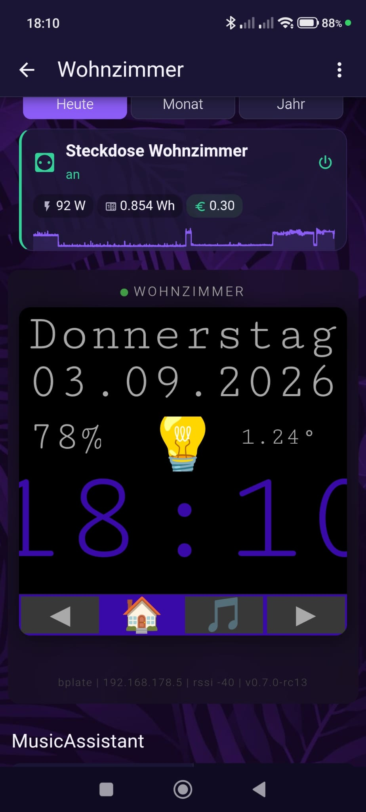

# openhasp-mirror-card

A custom **Home Assistant Lovelace card** that mirrors what your [openHASP](https://openhasp.com) touch displays are currently showing — rendered in the authentic openHASP look (black background, monospace, LVGL-style buttons) directly in your dashboard.

Works for both your **plate** (living room) and **bad** (bathroom) displays, and mirrors them **pixel-accurately** including:

- Every page from your openHASP `pages.jsonl` design
- Live HA values (temperature, humidity, light state, door lock, media title/artist/cover)
- Page sync with `number.<display>_page_number`
- Clickable buttons (radio stations, volume, stop, light toggle)
- "Es hat geklingelt" (doorbell) page with auto-switch and reset
- "Besetzt / Frei" bathroom occupancy display
- Responsive scaling for phone / tablet / desktop
- Visual card editor (display, title, canvas size, media entity)



## Installation

### HACS (recommended)

1. In HACS: **⋮ → Custom repositories** → add `https://github.com/Pissbirne/openhasp-mirror-card` with category **Dashboard (Lovelace)**
2. Click **Install**
3. Add the card to your dashboard

### Manual

1. Copy `openhasp-mirror-card.js` to your `/config/www/` folder
2. Add as a resource in **Settings → Dashboards → ⋮ → Resources**: `/local/openhasp-mirror-card.js`, type **JavaScript Module**
3. Add the card to your dashboard

## Usage

```yaml
type: custom:openhasp-mirror-card
display: plate
title: WOHNZIMMER
```

### Options

| Option | Type | Default | Description |
|--------|------|---------|-------------|
| `display` | string | *(required)* | The openHASP node name to mirror: `plate` or `bad` |
| `title` | string | uppercase display | Card title (e.g. `WOHNZIMMER`) |
| `canvas_size` | number | `380` | Max display size in px (auto-shrinks on phone) |
| `media_entity` | string | `media_player.grundig_soundbar_...` | Media player for Page 5 cover/title/artist |
| `entity_map` | object | *(merged with default)* | Override entity mappings |

### Bathroom "Besetzt / Frei" display

To show **Besetzt** (red) instead of the clock on the bathroom card when occupied, and the clock when free:

```yaml
type: custom:openhasp-mirror-card
display: bad
title: BAD
entity_map:
  p1b2:
    template: occupied_time
```

The `occupied_time` template shows `Besetzt` in red when the `timer.bad_belegt_verzogerung` timer is active, otherwise the current time. (Wire the timer via my HA helper + two automations.)

### Per-display light button

The light button (`p1b19`) is **display-aware** automatically:
- `display: plate` → toggles `light.controller_rgb_ir_ae8feb` (living room)
- `display: bad` → toggles `light.deckenlicht_bad` (bathroom ceiling)

### card-mod styling

The card follows the HA theme but you can override the container with card-mod:

```yaml
type: custom:openhasp-mirror-card
display: plate
title: WOHNZIMMER
card_mod:
  style: |
    ha-card {
      background: rgba(28, 28, 32, 0.55) !important;
      backdrop-filter: blur(20px) saturate(180%);
      border-radius: 16px;
    }
```

## Requirements

- openHASP displays configured with a `pages.jsonl` design (the current code ships with the user's 480×480 layout)
- Home Assistant with the `openhasp` integration

## License

MIT
